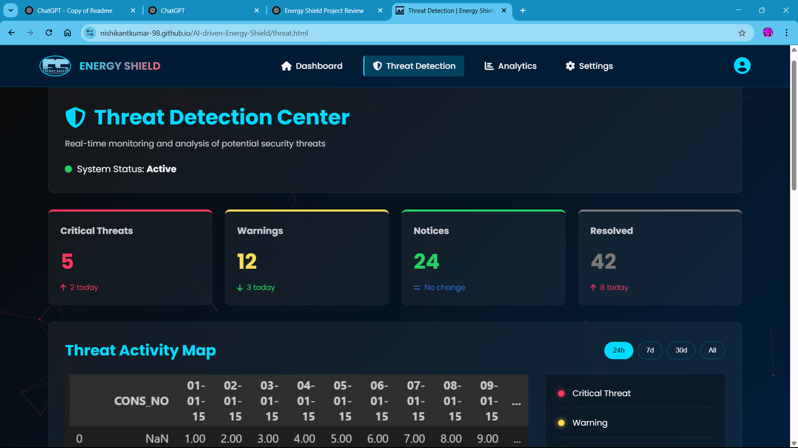

# Energy Shield By Team ECHO

## Project Overview

Energy Shield is an AI-powered power grid dashboard designed for **real-time monitoring**, **predictive analytics**, and **smart grid automation**. By leveraging **AI** and **IoT technologies**, Energy Shield enhances energy management, optimizes efficiency, and secures power grids against cyber threats.

### Problem Statement

Traditional power grid monitoring systems lack **predictive capabilities** and **automated responses** to fluctuations, faults, and security threats. Energy Shield addresses these challenges by offering:

- **Real-time Monitoring**: Continuous data visualization, anomaly detection, and instant alerts.
- **Predictive Analytics**: AI-driven forecasting of energy consumption, fault detection, and theft identification.
- **Smart Grid Automation**: Intelligent controls to optimize grid operations and prevent outages.
- **Security Features**: AI-based protection against cyber threats, unauthorized access, and data breaches.

---

## Technology Stack

### Frontend:

- **React.js** (for interactive UI and dashboards)
- **TailwindCSS** (for styling and responsive design)

### Backend:

- **Express.js** (Node.js framework for API handling)
- **MongoDB** (NoSQL database for storing energy metrics)
- **Python (Flask/Django)** (for AI model integration and API services)

### AI & Machine Learning:

- **TensorFlow, PyTorch** (for AI-driven anomaly detection and energy forecasting)
- **Scikit-learn, NumPy, Pandas** (for data preprocessing and statistical analysis)

### Cloud & IoT:

- **IoT Sensors** (Smart meters, voltage/current sensors for real-time energy data collection)
- **Apache Kafka** (for real-time data streaming and processing)
- **Cloud Deployment** (AWS/GCP/Azure for scalability and security)

---

## Accessing the Project

The project is live and accessible through GitHub. No dependencies or installations are required to run it locally.
- **Signup First for dashbord view from Link given in Live Preview**

### GitHub Repository

[Energy Shield](https://github.com/Nishikantkumar-98/AI-driven-Energy-Shield)

### Live Preview

[Deployed Link](https://nishikantkumar-98.github.io/ECHO/)

---

## Preview

Here are some screenshots of the project interface:

---

## Usage

- **Dashboard**: View real-time energy metrics, alerts, and analytics.
- **Predictive Analytics**: AI-based forecasting of energy demand and fault detection.
- **Control Panel**: Manage grid automation settings and security features.
- **Admin Panel**: Role-based access for utility companies and grid operators.

---

## Team Members

- **Himanshu** (Leader ,Backend Developer)
- **Nishikant** ( Frontend Developer)
- **Vishal** (Backend Developer, AI Specialist)
- **Aditya** (Frontend Developer, UI/UX Designer)

---

## Contribution Guidelines

Want to contribute? Follow these steps:

1. Fork the repository.
2. Create a new branch (`git checkout -b feature-branch`).
3. Commit your changes (`git commit -m 'Add feature'`).
4. Push to the branch (`git push origin feature-branch`).
5. Open a Pull Request.

---

## Future Plans

- **IoT Sensor Integration**: Expand sensor compatibility for more accurate real-time data.
- **Advanced AI-driven Automation**: Enhance predictive maintenance and automated energy load balancing.
- **Blockchain-Based Energy Trading**: Implement peer-to-peer energy transactions to promote renewable energy adoption.
- **Cybersecurity Enhancements**: Integrate blockchain for data integrity and decentralized security measures.
- **User Role Management**: Strengthen authentication and access controls for different user levels.
- **Mobile App Development**: Extend the platform to mobile devices for on-the-go monitoring and control.

---

## Submission Details for Code Forge Hackathon

- **GitHub Repository**: [Energy Shield](https://github.com/Nishikantkumar-98/AI-driven-Energy-Shield)
- **Short Video**: [View Project](https://github.com/NishikantKumar-98/AI-driven-Energy-Shield/blob/25f5f3787236cd5138aa61ed73573e615edd8c9f/Echo%20video.mp4)

---

##
